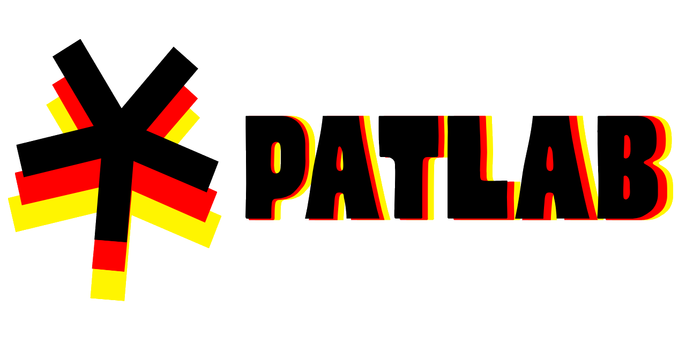

# 

[](https://pypi.org/project/patlab/)

[](LICENSE)
[](https://pypi.org/project/patlab/)
[](https://github.com/psf/black)
[](https://github.com/astral-sh/ruff)
[](https://github.com/sayampradhan/patlab/issues)
[](https://github.com/sayampradhan/patlab/stargazers)
<!-- [](https://codecov.io/gh/sayampradhan/patlab) -->
<!-- [](https://github.com/your-username/patlab/actions) -->

**Patlab** is a lightweight Python library for generating common text-based patterns such as squares, pyramids, and triangles with clean and customizable APIs.

It’s designed for beginners, educators, and developers who want a simple way to generate patterns programmatically.

## ✨ Features

- Generate common patterns easily:
  - Squares
  - Pyramids (centered, right-aligned, numeric)
  - Right-angled triangles (classic, inverted)
- Support for:
  - Custom characters
  - Hollow patterns
  - Numeric patterns
- Clean, readable API design
- Minimal dependencies

## 📦 Installation

Install via pip:

```bash
pip install patlab
```

## 🚀 Quick Start
```python
from patlab.basic import square
from patlab.pyramid import centered
from patlab.right_triangle import classic

print(square(3))
print(centered(4))
print(classic(4))
```

## 📐 Usage Examples
### Square
```python
from patlab.basic import square

print(square(4))
print(square(4, "#"))
```
```
****
****
****
****
```

### Pyramids
#### Centered Pyramids
```python
from patlab.pyramid import centered

print(centered(4))
```
```
   *
  ***
 *****
*******
```

#### Hollow Pyramid
```python
print(centered(4, hollow=True))
```
```
   *
  * *
 *   *
*******
```

#### Right-Aligned Pyramid
```python
from patlab.pyramid import right_aligned

print(right_aligned(4))
```
```
*
**
***
****
```

#### Numeric Pyramid
```python
from patlab.pyramid import numeric

print(numeric(4))
```
```
   1
  12
 123
1234
```

#### Factory Method
```python
from patlab.pyramid import make

print(make(4, variant="centered"))
print(make(4, variant="right", char="#"))
print(make(4, variant="numeric"))
```

### Right-Angled Triangles
#### Classic Triangle
```python
from patlab.right_triangle import classic

print(classic(4))
```
```
*
**
***
****
```

#### Hollow Triangle
```python
print(classic(4, hollow=True))
```
```
*
**
* *
****
```

#### Numeric Triangle
```python
print(classic(4, numeric=True))
```
```
1
12
123
1234
```

#### Inverted Triangle
```python
from patlab.right_triangle import inverted

print(inverted(4))
```
```
****
***
**
*
```

#### Triangle Factory
```python
from patlab.right_triangle import make

print(make(4, variant="classic"))
print(make(4, variant="inverted"))
```

## 🧪 Testing
Tests are included using `pytest`.

Run tests locally:
```
pytest
```

## 📜 License
This project is licensed under the terms of the MIT License.

## 🤝 Contributing

Contributions are welcome!

If you’d like to improve Patlab:
1. Fork the repository
2. Create a feature branch
3. Submit a pull request

## 💡 Inspiration

Patlab is inspired by classic programming exercises used to teach loops, logic, and formatting in Python.

If you've ever written code to print stars (`*`) in shapes like pyramids, triangles, or squares while learning Python, you've already experienced the core idea behind this library.

Patlab builds on those foundational exercises by:

- Turning repetitive pattern-printing logic into reusable functions  
- Providing clean abstractions over nested loops  
- Making it easier to experiment with variations (hollow, numeric, aligned patterns)  
- Helping beginners transition from practice problems to structured code  

It aims to bridge the gap between **learning concepts** and **building reusable tools**, making pattern generation both educational and practical.

